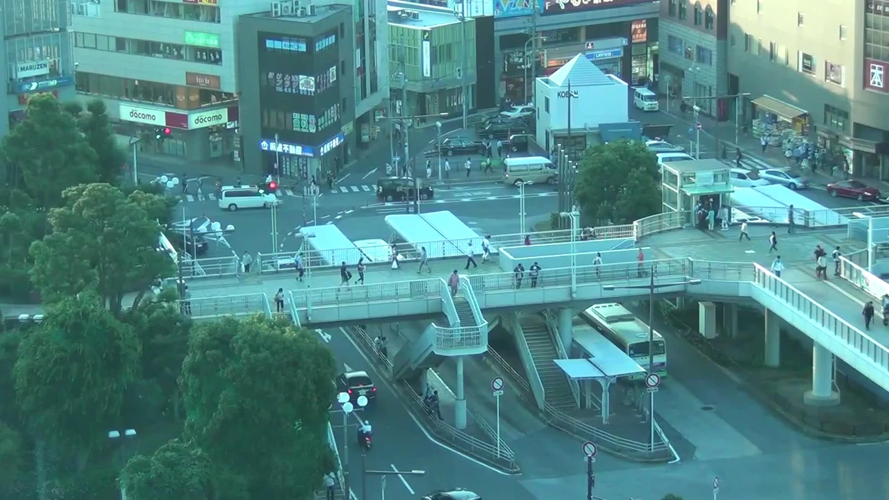
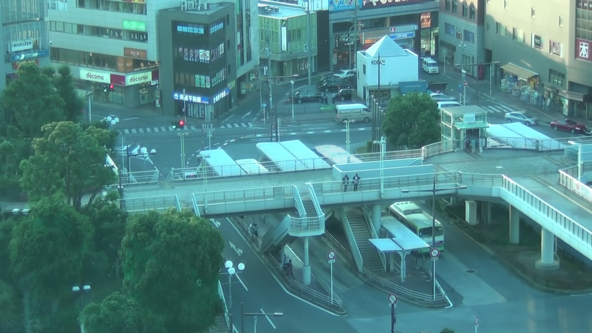

# Isolator

## Summary
I got the idea from the following Japanese blog post. (thanks!)

* ["A handy way to make pedestrians disappear from the landscape"](http://blog.unfindable.net/archives/7618)

## Examples
* Before (http://www.youtube.com/watch?v=Pe6OAxlqDss):

* After:


## Prerequisites
Isolator requires Java bindings for OpenCV. OpenCV also requires JDK and [Ant](http://ant.apache.org/) to build them. See [the document](http://docs.opencv.org/doc/tutorials/introduction/desktop_java/java_dev_intro.html) for more details.

```
$ curl -OL https://github.com/Itseez/opencv/archive/2.4.9.zip -o opencv-2.4.9.zip
$ unzip opencv-2.4.9.zip
$ cd opencv-2.4.9
$ mkdir build
$ cd build/
$ cmake -DBUILD_SHARED_LIBS=OFF ..
$ make -j8
```

Copy both `opencv-249.jar` and `libopencv_java249.so` to `lib/` directory after the build is successful.

## Usage
```
$ bin/isolator <input> <output>
```
